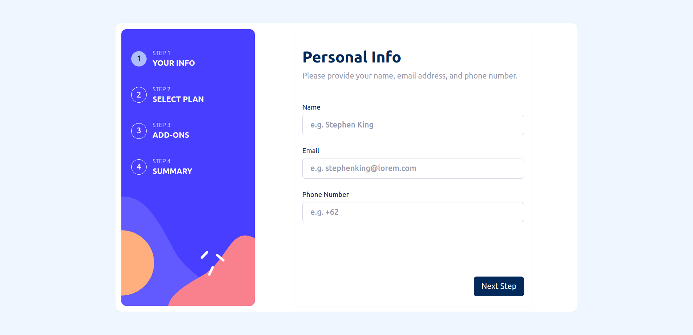
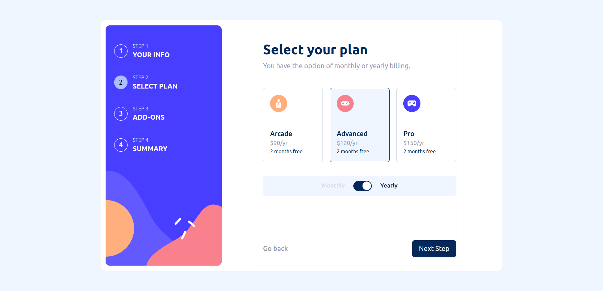
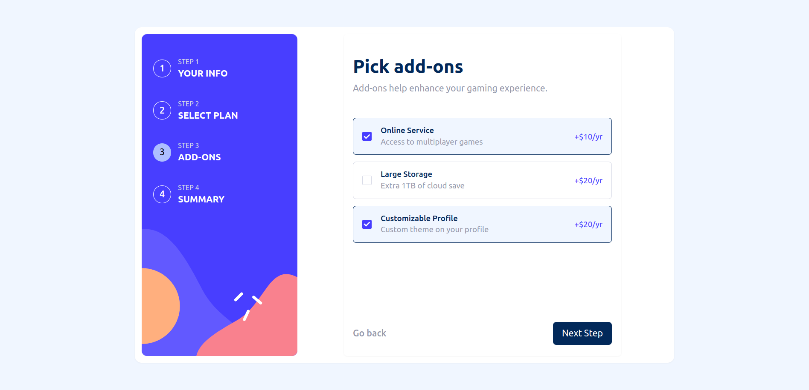
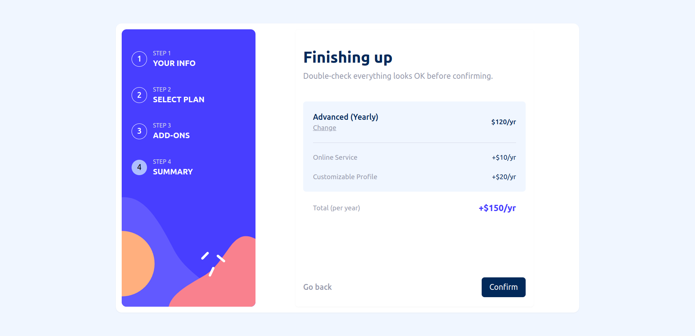
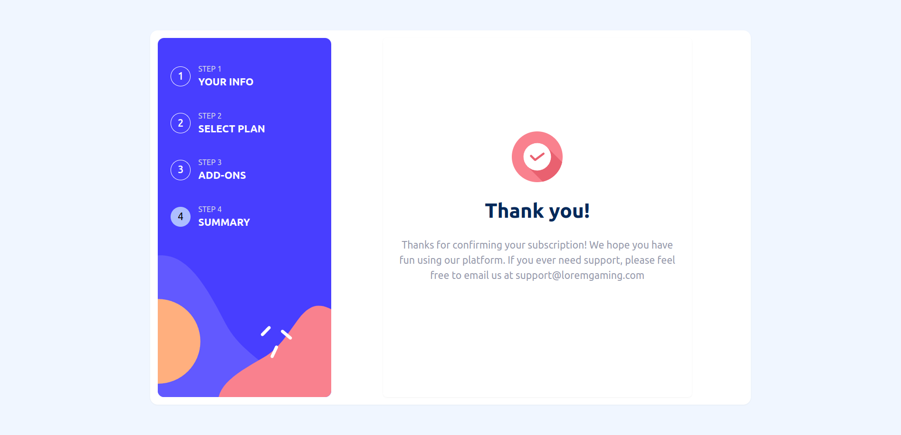
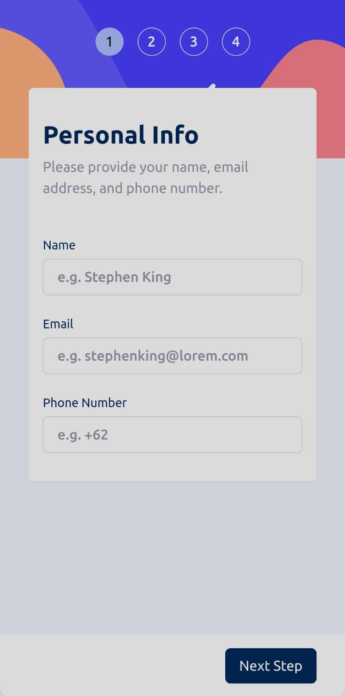
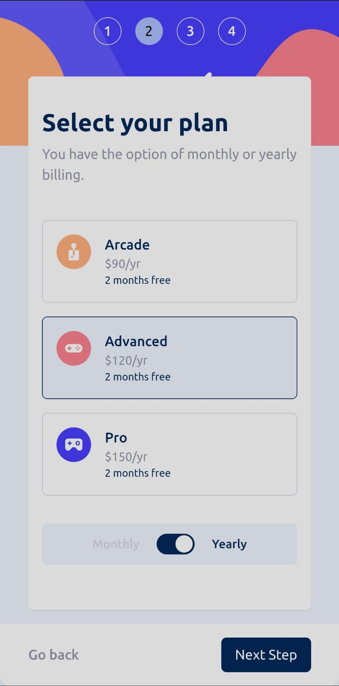
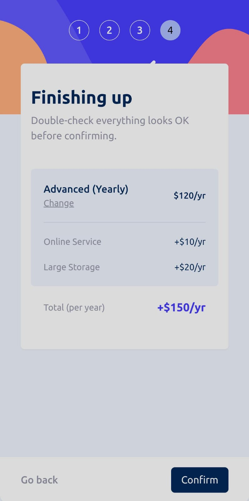

# Multi-Step Form

This is a solution to the [Multi-step form challenge on Frontend Mentor](https://www.frontendmentor.io/challenges/multistep-form-YVAnSdqQBJ). Frontend Mentor challenges help you improve your coding skills by building realistic projects. 

## Table of contents

- [Overview](#overview)
  - [The challenge](#the-challenge)
  - [Screenshot](#screenshot)
    - [Desktop](#desktop)
    - [Mobile](#mobile)
  - [Links](#links)
- [My process](#my-process)
  - [Built with](#built-with)
- [Author](#author)

## Overview

### The challenge

Users should be able to:

- Complete each step of the sequence
- Go back to a previous step to update their selections
- See a summary of their selections on the final step and confirm their order
- View the optimal layout for the interface depending on their device's screen size
- See hover and focus states for all interactive elements on the page
- Receive form validation messages if:
  - A field has been missed
  - The email address is not formatted correctly
  - A step is submitted, but no selection has been made

### Screenshot
#### Desktop

#### Mobile

### Links

- Solution URL: [Github](https://github.com/yukiao/Multi-Step-Form.git)
- Live Site URL: [Add live site URL here](https://your-live-site-url.com)

## My process

### Built with

- Flexbox
- CSS Grid
- [Typescript](https://www.typescriptlang.org/)
- [React](https://reactjs.org/)
- [React Redux](https://react-redux.js.org/)

## Author

- Github - [Yukiao](https://github.com/yukiao)
- Frontend Mentor - [@yukiao](https://www.frontendmentor.io/profile/yukiao)
- Linkedin - [Silverius Sony Lembang](www.linkedin.com/in/silverius-sony-lembang-b378a5250)
